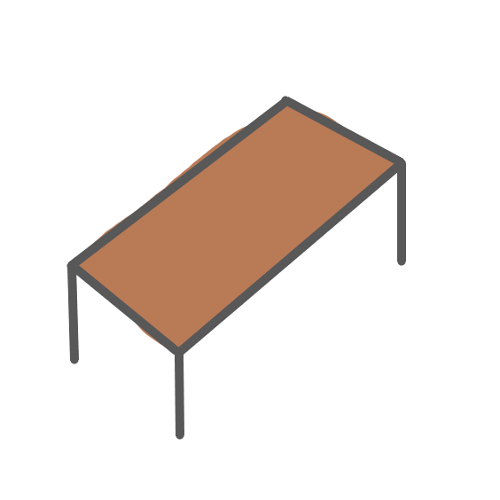
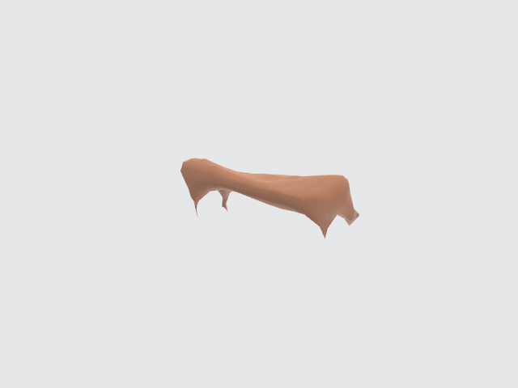

# 3D-Reconstruction of Common Objects from a Single RGB Image

## About

    
    

The focus of this project is to develop Computer Vision software for 3D reconstruction of common objects given a single RGB image.

The final software takes a single image as an input, generates a point cloud representing the object in the image using a CNN and converts this to a 3D mesh using the alpha shapes algorithm, before finally applying a simple uniform texture to this mesh.
Python was used to develop the application and Keras was used to develop the models.

This project was undertaken for my Electronic and Computer Engineering Master's Thesis :smiley:. [Here](3D_Reconstruction_of_Common_Objects.pdf) is a copy of the final report.

## Requirements

Packages specified in `requirements.txt` file are not currently exhaustive.
